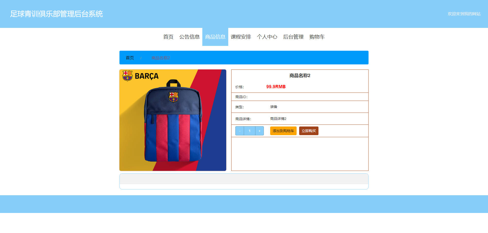

# 基于Springboot的足球青训俱乐部管理后台系统

## Springboot-0039


## 技术栈

Springboot mybatisplus vue mysql maven


## 数据库表(14张)


## 功能介绍

```properties
学员进入系统前台可查看系统信息，包括首页、公告信息、商品信息以及课程安排等，学员要想实现加入购物车、购买商品等操作，必须登录系统，未有账号的学员可进行注册操作，注册登录后主要功能模块包括购物车、上课签到、个人中心、我的订单、我的地址。

管理员可登录系统后对系统进行全面管理，管理员登陆后主要功能模块包括个人中心、学员管理、教练管理、公告信息管理、商品信息管理、课程安排管理、课程签到管理、统计中心管理、系统管理以及订单管理。

教练注册登录后主要功能模块包括个人中心、公告信息管理、商品信息管理、课程安排管理以及课程签到管理。
```


## 图片

### 前台





### 

### 后台


## 访问路径

### 前台

```properties
http://localhost:8080/springbootr4n67/front/pages/login/login.html

账号 学员6
密码 123456
```

### 后台

```properties
http://localhost:8080/springbootr4n67/admin/dist/index.html#/login

账号 admin
密码 admin
```


## 功能图


## 文档目录


## 打赏或交流


